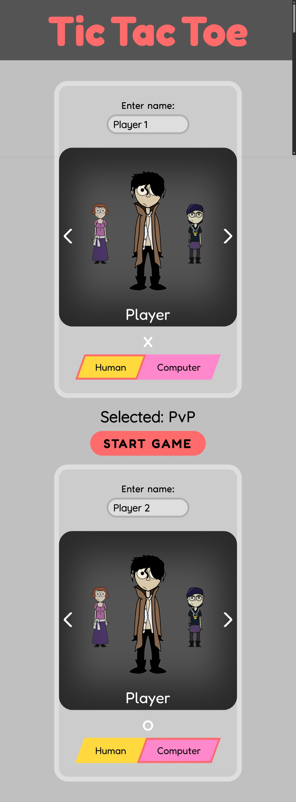
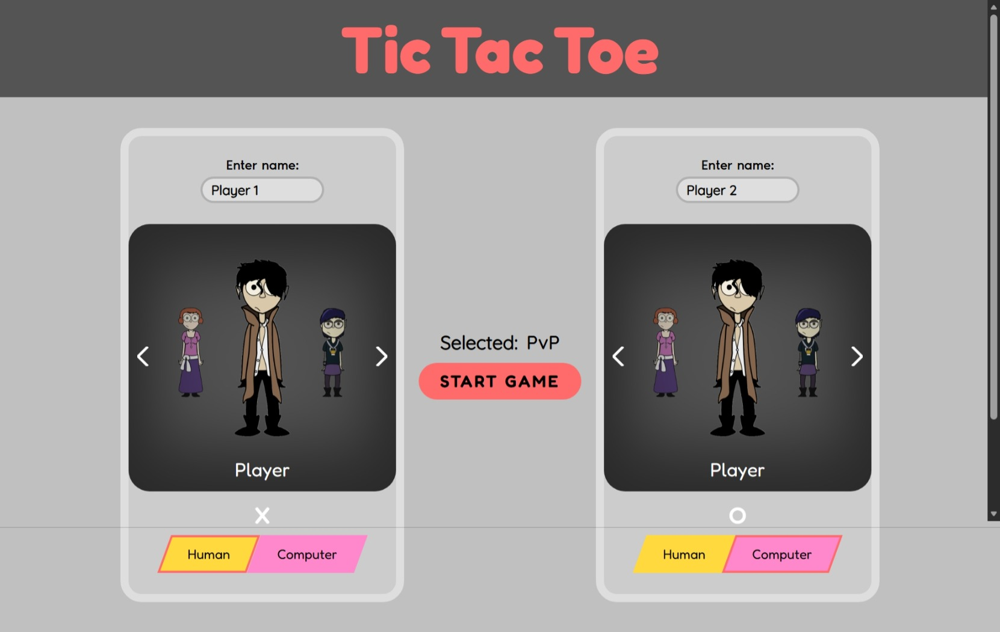
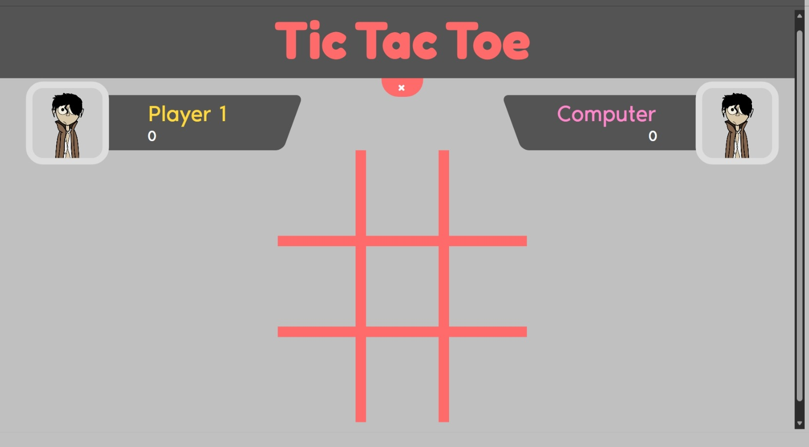

# The Odin Project - Tic Tac Toe

This is a solution to the [Tic Tac Toe Challenge on The Odin Project](https://www.theodinproject.com/lessons/node-path-javascript-tic-tac-toe). 

## Table of contents

- [The Odin Project - Tic Tac Toe](#the-odin-project---tic-tac-toe)
  - [Table of contents](#table-of-contents)
  - [Overview](#overview)
    - [The Challenge](#the-challenge)
    - [Screenshot](#screenshot)
    - [Links](#links)
    - [Author](#author)
  - [Acknowledgments](#acknowledgments)
    - [Project Continued development](#project-continued-development)
  

## Overview

### The Challenge

Users should be able to:

- View the optimal layout for each of the website's pages depending on their device's screen size
- See hover states for all interactive elements on the page
- Play and Interact with the TicTacToe game

### Screenshot

  <figure style="margin: 0; height: 100%; text-align: center; width: 40%;">
    <figcaption>Mobile preview</figcaption>
    
  </figure>

  

    <figure style="margin: 0; width: 100%; text-align: center;">
      <figcaption>Desltop preview</figcaption>
      
    </figure>
    <figure style="margin: 0; width: 100%; text-align: center;">
      <figcaption>Gameboard preview</figcaption>
      
    </figure>
  

### Links

- [Solution URL](https://github.com/Aon-m/Tic-tac-toe/)
- [Live Server URL](https://aon-m.github.io/Tic-tac-toe/)

### Author

- Frontend Mentor - [@Aon](https://www.frontendmentor.io/profile/Aon-m)
- CSSBattle - [@Aon](https://cssbattle.dev/player/aon)
- Github - [@Aon-m](https://github.com/Aon-m)

## Acknowledgments

- The UI and game progression of the project was inspired by TheOnlyHamster's [TicTacToe](https://theonlyhamstertoh.github.io/tictactoe/) project on [The Odin Project](https://www.theodinproject.com/).
- The Characters featured on the cards are gotten from [BLTX](https://forums.tapas.io/t/character-reference-sheets-are-important-for-any-comic/67362)
- The template for this README file was gotten from [Frontend Mentor](https://www.frontendmentor.io/)

### Project Continued development

Additional features, such as animations, may be implemented in future updates.
